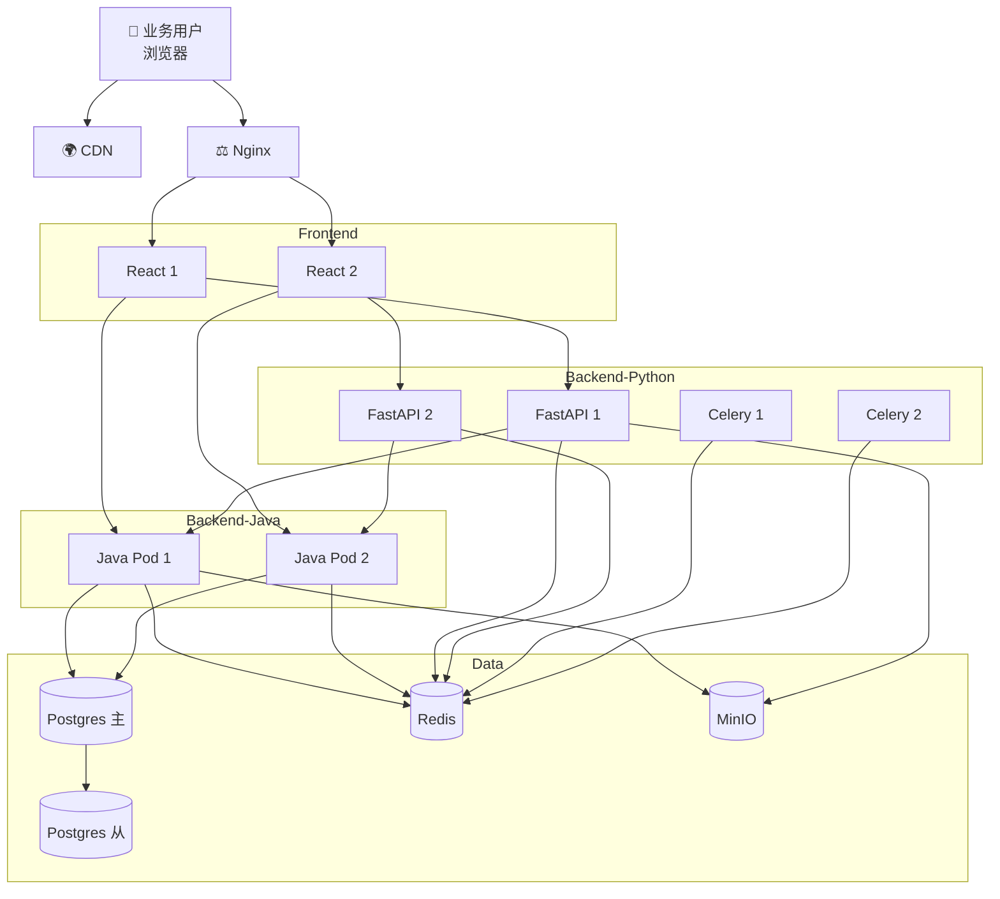
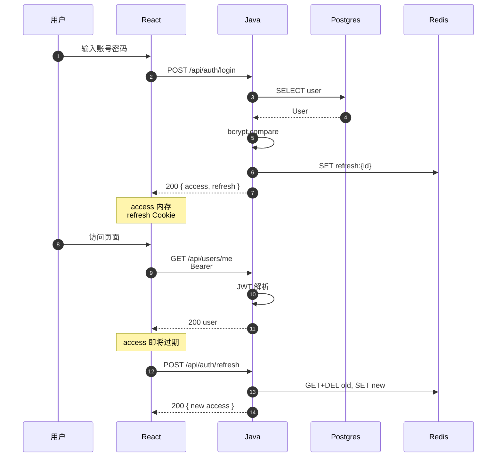
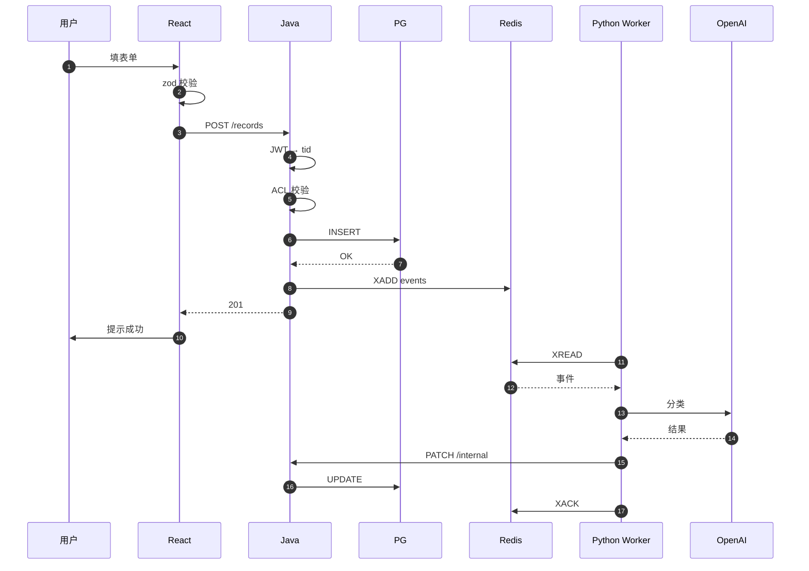
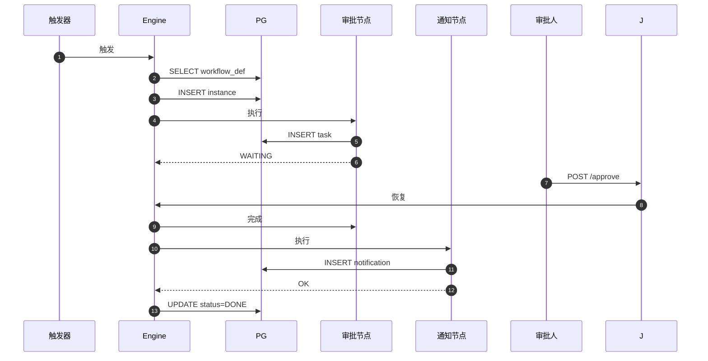
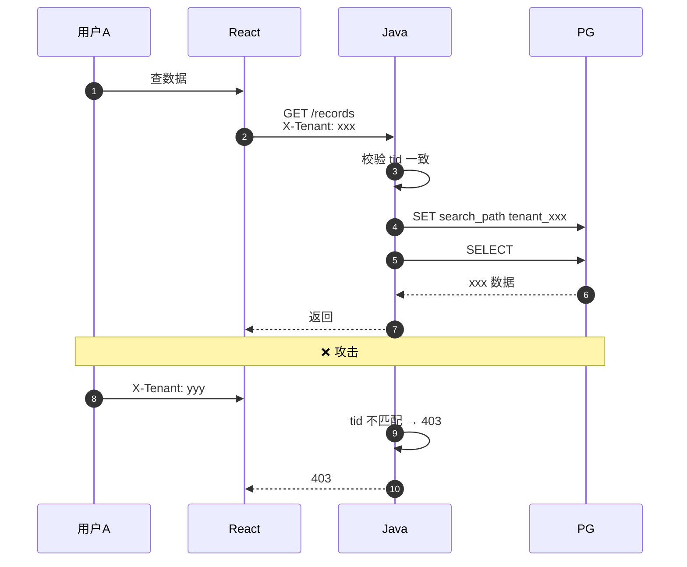

# 架构图

> 创建日期: 2026-09-09
> 配套: ARCHITECTURE.md(高层),ADR/(详细)
> 工具: Mermaid(纯文本,Github/GitLab 可直接渲染)

---

## 一、部署架构图



## 二、登录鉴权时序图



## 三、数据提交时序图



## 四、工作流执行时序图



## 五、跨租户隔离时序图



## 六、整体类比(给非技术人)

```
前端(React)        = 餐厅前台
Java 后端          = 厨房主管
Python 后端        = 外卖配送
PostgreSQL         = 食材仓库
Redis              = 备菜台
MinIO              = 冷库
LLM                = 美食顾问
```
